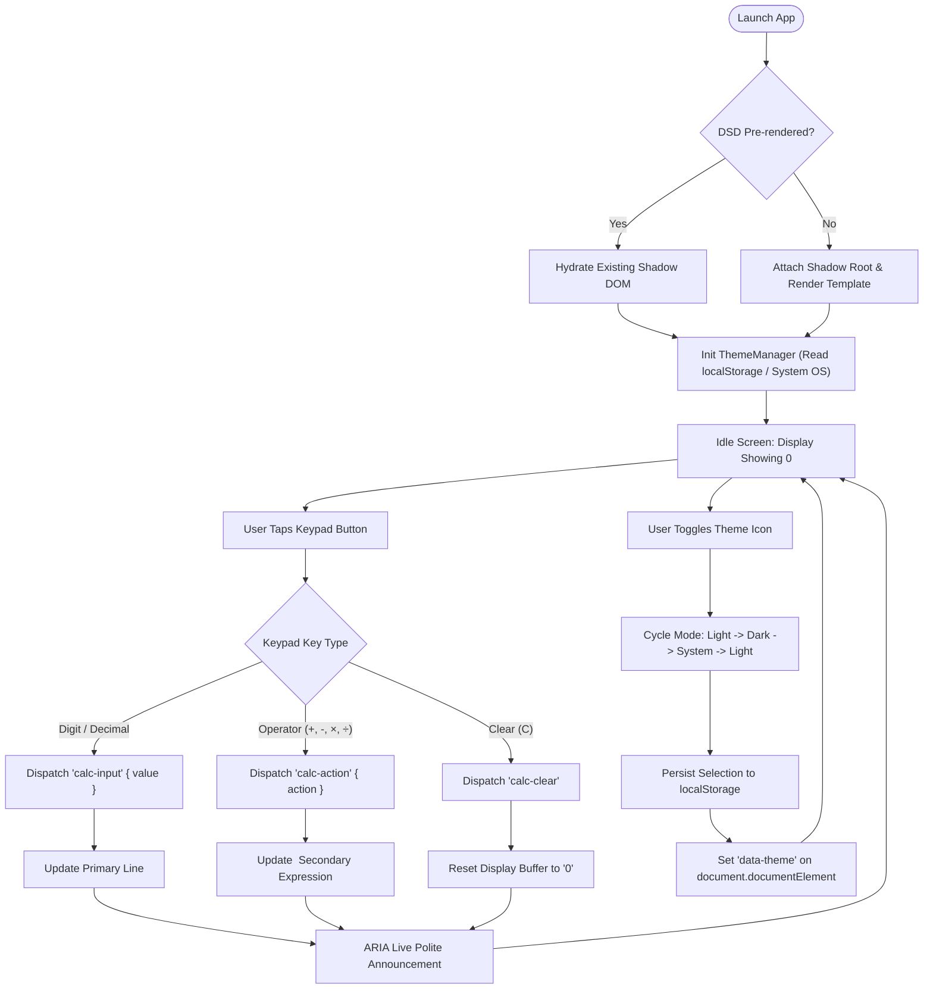

# App Shell and Theme Interaction Flow

## 1. Flow Overview

This document maps screen transitions, user interactions, theme toggle states, and keypad entry flows within the StayCalc application shell.

## 2. Mermaid Interaction & State Flow

## 3. Screen & Component States

- `SCR-SHELL-001` (Initial App Launch): Renders `<stay-calc-app>` with header, dual-line display showing `0`, and 4-column arithmetic keypad.
- `SCR-SHELL-002` (Theme Toggled): Color palette shifts instantly between light and dark modes with smooth CSS transitions without component re-render.
- `SCR-SHELL-003` (Active Key Entry): Digits appear in real time on the primary display line; operator keys highlight momentarily with `:active` pill feedback.
- `SCR-SHELL-004` (Display Character Overflow): When input exceeds 10 digits, font size scales down dynamically via CSS `clamp()` and responsive scaling rules to prevent container clipping.

## 4. Decision Nodes & Error Recovery

- `DEC-THEME-001`: If `localStorage` holds explicit theme (`"light"` or `"dark"`), apply that mode. Otherwise, resolve match against `window.matchMedia('(prefers-color-scheme: dark)')`.
- `REC-STORAGE-001`: If `localStorage` access throws due to incognito sandbox security policies, log a non-fatal warning and maintain active theme preference in memory.
