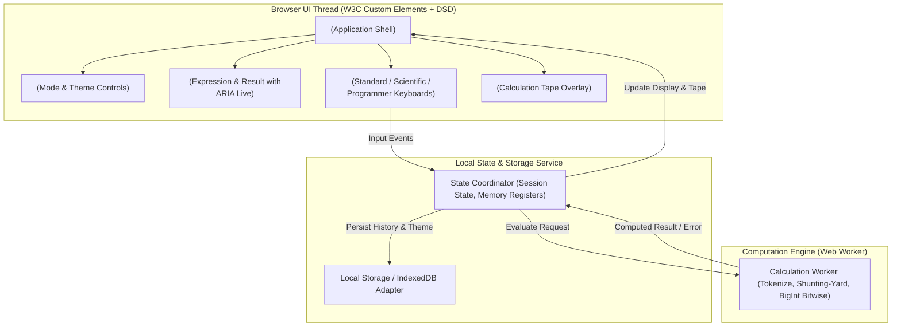

# StayCalc System Architecture

## 1. System Topology

StayCalc operates as a fully client-side Progressive Web Application (PWA) with componentized W3C Custom Elements and an isolated Web Worker calculation engine:

## 2. Component Boundaries

1. **`<stay-calc-app>`**: Top-level host element managing global keyboard events, active mode routing (`standard`, `scientific`, `programmer`), and theme binding (`light`, `dark`).
2. **`<stay-calc-header>`**: Navigation bar displaying the brand mark, calculation mode selector pills, history toggle button, and theme switch toggle.
3. **`<stay-calc-display>`**: High-contrast, dynamic text display rendering active expression buffer, current evaluation result, memory indicators (`M`), and accessible `aria-live="polite"` announcements.
4. **`<stay-calc-keypad>`**: Responsive grid container projecting standard numeric buttons, operational action triggers (`+`, `-`, `×`, `÷`, `=`), scientific function keys (`sin`, `cos`, `log`, `π`, `^`), and programmer radix/bitwise buttons (`AND`, `OR`, `XOR`, `HEX`, `BIN`).
5. **`<stay-calc-history>`**: Slide-over drawer presenting chronologically recorded calculation entries with one-click reload into the active display buffer.

## 3. Data Flow & Evaluation Lifecycle

- **Input Ingestion**: Button taps and hardware keyboard strokes are normalized into atomic tokens (`NUMBER`, `OPERATOR`, `FUNCTION`, `CONTROL`).
- **Calculation Execution**: Expressions are parsed using a deterministic tokenizer and operator-precedence parser (Shunting-Yard algorithm) inside a dedicated Web Worker to ensure zero UI jank.
- **Precision Normalization**: Decimal floating-point arithmetic is normalized using scaled integer math / epsilon correction to prevent binary approximation artifacts.
- **Persistence**: Successful evaluations are prepended to the local storage history tape and capped at 100 entries.
