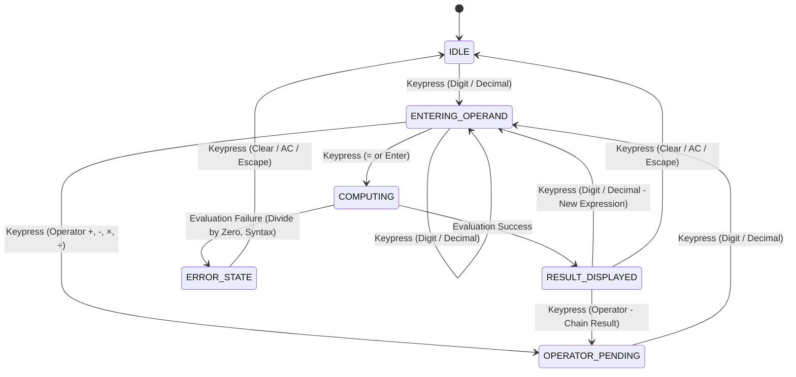

# StayCalc Entity Statuses & State Machines

## 1. Calculator Engine State Machine

The calculator core transitions across discrete states during user interactions:

## 2. Theme State Machine

- **`SYSTEM_AUTO`**: Follows browser/OS `prefers-color-scheme`.
- **`LIGHT`**: Forced light theme (`sl-background: #ffffff`).
- **`DARK`**: Forced dark theme (`sl-background: #09090b`).

## 3. PWA Lifecycle States

- **`INSTALLING`**: Service worker downloading assets.
- **`OFFLINE_READY`**: Assets cached, app fully operable offline.
- **`UPDATE_AVAILABLE`**: New application version detected; banner ready to prompt reload.
