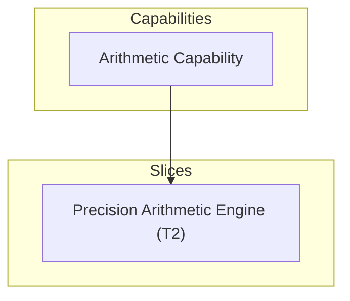

# Specification Atlas

```mermaid
flowchart TD
  subgraph Capabilities
    Arithmetic["Arithmetic Capability"]
  end

  subgraph Slices
    Engine["Precision Arithmetic Engine (T2)"]
  end

  Arithmetic --> Engine
```
