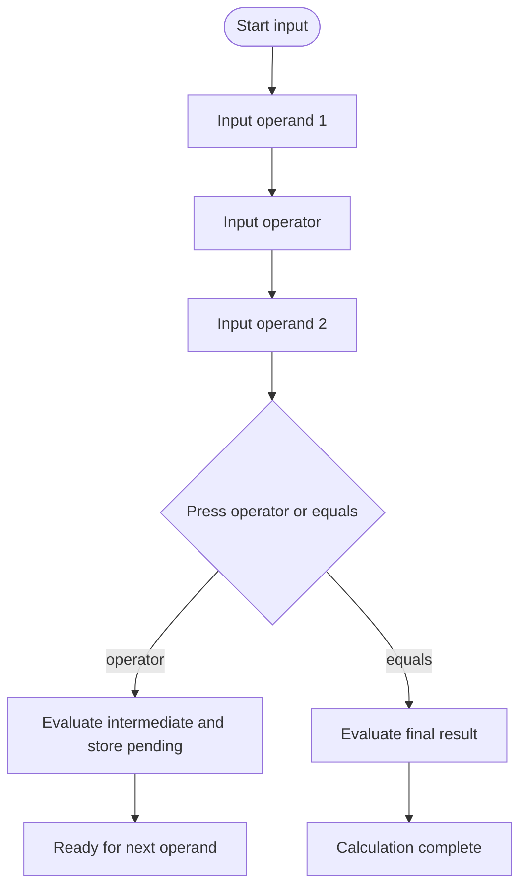
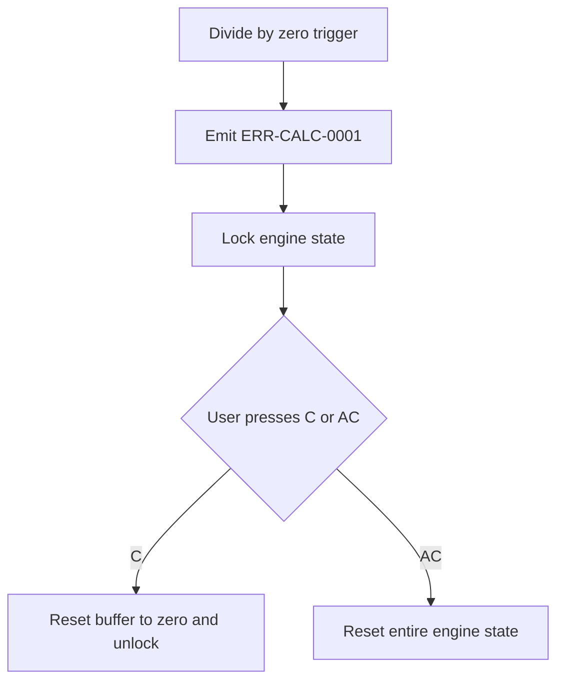

# Flows

Up: [feature](./feature.md). Next: [cases](./cases.md).

## FLW-CALC-01 Immediate calculation flow

```mermaid
flowchart TD
  S(["Start input"]) --> A["Input operand 1"]
  A --> B["Input operator"]
  B --> C["Input operand 2"]
  C --> D{"Press operator or equals"}
  D -- operator --> E["Evaluate intermediate and store pending"]
  D -- equals --> F["Evaluate final result"]
  E --> G["Ready for next operand"]
  F --> H["Calculation complete"]
```

## FLW-CALC-02 Division by zero and error recovery

```mermaid
flowchart TD
  A["Divide by zero trigger"] --> B["Emit ERR-CALC-0001"]
  B --> C["Lock engine state"]
  C --> D{"User presses C or AC"}
  D -- C --> E["Reset buffer to zero and unlock"]
  D -- AC --> F["Reset entire engine state"]
```
