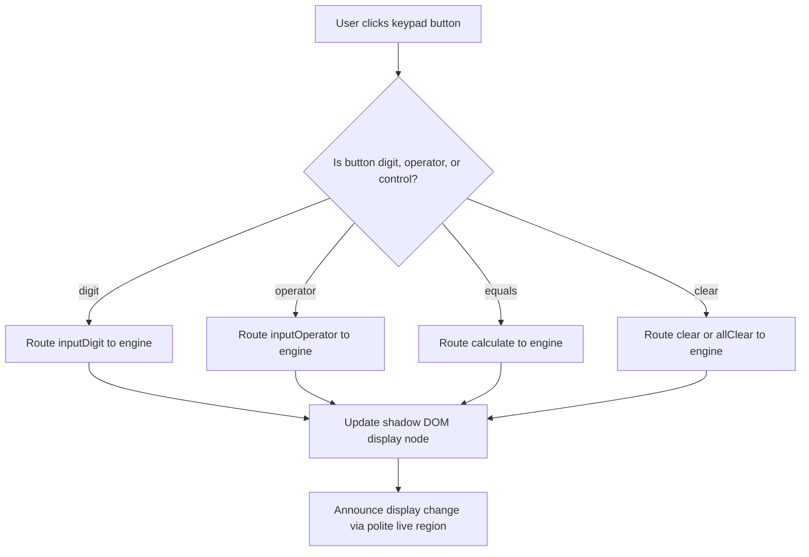
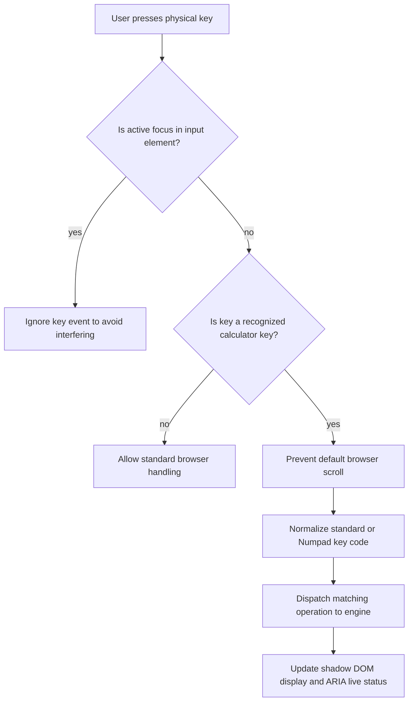

# Flows

Up: [feature](./feature.md). Next: [cases](./cases.md).

## FLW-UI-01 Keypad interaction and display update flow

```mermaid
flowchart TD
  A["User clicks keypad button"] --> B{"Is button digit, operator, or control?"}
  B -- digit --> C["Route inputDigit to engine"]
  B -- operator --> D["Route inputOperator to engine"]
  B -- equals --> E["Route calculate to engine"]
  B -- clear --> F["Route clear or allClear to engine"]
  C --> G["Update shadow DOM display node"]
  D --> G
  E --> G
  F --> G
  G --> H["Announce display change via polite live region"]
```

## FLW-UI-02 Keyboard event delegation and calculation flow

```mermaid
flowchart TD
  K["User presses physical key"] --> L{"Is active focus in input element?"}
  L -- yes --> M["Ignore key event to avoid interfering"]
  L -- no --> N{"Is key a recognized calculator key?"}
  N -- no --> P["Allow standard browser handling"]
  N -- yes --> Q["Prevent default browser scroll"]
  Q --> R["Normalize standard or Numpad key code"]
  R --> S["Dispatch matching operation to engine"]
  S --> T["Update shadow DOM display and ARIA live status"]
```
