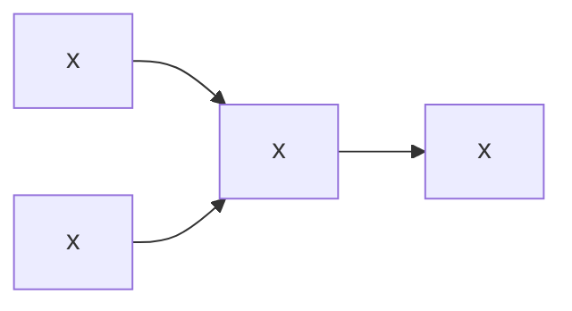

# Actors

Up: [README](../README.md). Access detail is in the access matrix; this page names the actors only.

```mermaid
flowchart LR
  V["x"] --> U["x"] --> O["x"]
  S["x"] --> U
```

| Actor | Who | Can start | Cannot |
| :--- | :--- | :--- | :--- |
| x | x | x | x |
