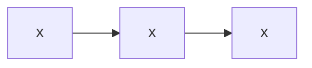

# Vision

Up: [README](../README.md). Next: [scope](./scope.md).

x

```mermaid
flowchart LR
  P["x"] --> N["x"] --> O["x"]
```

## Principles

- x

## Success measures

| Measure | Owner of the number |
| :--- | :--- |
| x | x |
